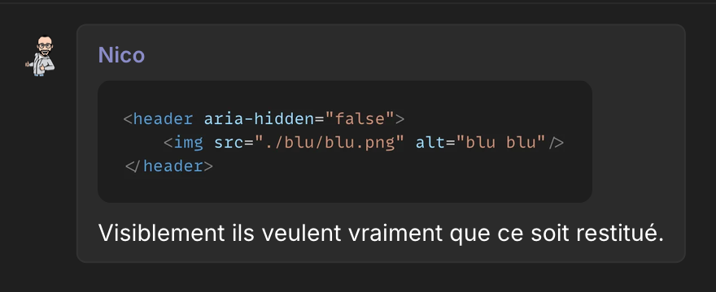
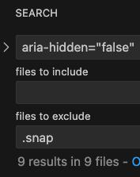

## `aria-hidden="true"`

Alors je ne sais pas vous, mais moi j'ai toujours mis `aria-hidden="true"` sans trop réfléchir.

```html
<!-- Une icône -->
<span class="fa fa-blu" aria-hidden="true"></span>

<!-- Les flèches d'une pagination -->
<a href="#" aria-label="Précédent"><span aria-hidden="true">&laquo;</span></a>

<!-- L'astérisque d'un champ obligatoire -->
<label for="nom">Nom <span aria-hidden="true">*</span></label>
<input id="nom" type="text" required />

<!-- Une ancienne modale -->
<div class="modal" tabindex="-1" aria-hidden="true">...</div>
```

Et j'en passe...

Pour faire simple, cet attribut permet de définir si le contenu d'un élément doit être retiré de l'API d'accessibilité, ce qui aura pour conséquence qu'il ne sera pas restitué par les technologies d'assistance.
Je ne vais pas détailler plus que ça. Ce n'est pas le but ici et, vu mon public, je ne pense pas que ce soit nécessaire.

## `aria-hidden="false"`

Et puis un jour, on m'a partagé ça :



Effectivement, on ne pourrait pas être plus clair.

Mais comme, au final, cela ne me semblait avoir aucun sens, je me suis renseigné pour savoir dans quels cas on pouvait en avoir besoin.

## `aria-hidden`

Alors ma première réflexion a été de me demander pourquoi `aria-hidden="true"` et pas juste `aria-hidden`.
On est sur une notion booléenne : oui ou non, on cache ou l'on restitue l'information. La présence ou non de l'attribut devrait suffire. Là, si l'on veut vraiment indiquer le `false`, c'est qu'il doit y avoir une raison.

Un peu comme le `aria-expanded="false"`.
Je sais que vous l'avez tous en tête là ;)

## « Je ne veux pas que ce contenu soit masqué »

Alors, dans quel cas cela peut-il sembler utile de dire « je ne veux pas que ce contenu soit masqué », sachant que c'est le comportement par défaut de tous les éléments ?
Sauf le `<dialog>`, ok, je vous vois venir :)

Première idée : avoir un `aria-hidden="false"` dans un `aria-hidden="true"` ?

```html
<span aria-hidden="true">
  Contenu non restitué.
  <span aria-hidden="false">Ce contenu est-il restitué ?</span>
</span>
```

Franchement, je n'y crois pas, ça n'a pas trop de sens, mais j'ai testé et... ce n'est pas ça.

## MDN

Bon, à un moment, il faut aller voir la doc. Que dit le MDN sur l'utilisation de la valeur `"false"` ? Est-ce qu'elle existe d'ailleurs ?

Alors oui ! Vous avez douté aussi ? :)

Sur [la page du MDN de `aria-hidden`](https://developer.mozilla.org/docs/Web/Accessibility/ARIA/Reference/Attributes/aria-hidden), on ne retrouve que deux fois la mention du `false`.

La première :

> <span lang="en">Using aria-hidden="false" will not re-expose the element to assistive technology if any of its parents specify aria-hidden="true".</span>

Traduction : « Utiliser `aria-hidden="false"` ne réexpose pas l'élément aux technologies d'assistance si l'un de ses parents définit `aria-hidden="true"`. »

Oh bah tiens, j'aurais dû commencer par là ! 😅

La seconde, dans les valeurs possibles :

> <span lang="en">`false`: The element is exposed to the accessibility API as if it was rendered.</span>

Traduction : « L'élément est exposé à l'API d'accessibilité comme s'il était rendu. »

On va revenir dessus. Parce que dans cette liste de valeurs, que je pensais booléenne, il y en a une troisième !

## `undefined`

`undefined`, qui en plus est la valeur par défaut !

Mais qu'est-ce que cela veut dire, ce `undefined` ? Est-ce que l'on définit un comportement si l'attribut `aria-hidden` n'est pas présent ?

> <span lang="en">`undefined` (default): The element's hidden state is determined by the user agent based on whether it is rendered.</span>

Traduction : « L'état masqué de l'élément est déterminé par l'agent utilisateur selon qu'il est rendu ou non. »

Alors je ne sais pas vous, mais perso, à ce moment-là, je ne comprends plus grand-chose. Moi qui pensais trouver un exemple clair d'utilisation du `aria-hidden="false"`. :)

## `aria-hidden="undefined"`

Ne comprenant pas ce `undefined`, je suis allé voir ce qui se disait sur [la propriété JavaScript `ariaHidden`](https://developer.mozilla.org/docs/Web/API/Element/ariaHidden) et là, je me rends compte que la valeur n'est pas `undefined` mais `"undefined"`, la chaîne de caractères.
Comme `"true"` et `"false"` finalement. Soit `aria-hidden="undefined"` !

Okay...

Si je reprends la définition, l'agent utilisateur décide seul, selon que l'élément est rendu ou non :

```html
<!-- Rendu : restitué -->
<span aria-hidden="undefined">Blu</span>

<!-- Non rendu : non restitué -->
<span aria-hidden="undefined" style="display: none;">Blu</span>
```

Autrement dit, exactement ce qu'il se passe quand on ne met pas d'attribut du tout. Écrire `aria-hidden="undefined"`, c'est écrire explicitement… la valeur par défaut.

Bon, sinon, dans les exemples de `ariaHidden`, on y voit un cas où l'on passe de `"true"` à `"false"`. Pourquoi pas, mais autant retirer l'attribut, non ?

## « Comme s'il était rendu »

Pour revenir sur la définition de la valeur `"false"` : « l'élément est exposé à l'API d'accessibilité comme s'il était rendu ». Que veut dire « comme s'il était rendu » ? Qu'est-ce qu'un élément non rendu ? Un élément en `display: none;` ou encore en `visibility: hidden;` ?

Donc si je fais :

```html
<span style="display: none;" aria-hidden="false">Blu</span>
```

Mon « Blu » sera restitué sans être visible ?

Un peu comme si on utilisait une classe `.sr-only` ou `.visually-hidden` ? Mais pourquoi utilise-t-on ces classes, du coup ?
Oui, je lis dans vos pensées ! :D

Eh bien j'ai testé et... ça ne fonctionne pas ! C'est sûrement pour ça que ces classes sont utiles finalement.

Bon, du coup, je ne sais toujours pas quand utiliser `aria-hidden="false"`, et encore moins `aria-hidden="undefined"`.

## W3C

Eh bien, allons voir [la spec](https://w3c.github.io/aria/#aria-hidden).

Et là, tout y est !

On commence à avoir des éléments de réponse :

> <span lang="en">User agents determine an element's hidden status based on whether it is rendered, and the rendering is usually controlled by CSS. For example, an element whose display property is set to none is not rendered.</span>

Traduction : « Les agents utilisateurs déterminent l'état masqué d'un élément selon qu'il est rendu ou non, et le rendu est généralement contrôlé par le CSS. Par exemple, un élément dont la propriété `display` vaut `none` n'est pas rendu. »

Cela correspond à ce que l'on vient de dire, même si ça ne fonctionne pas.

> <span lang="en">An element will be excluded from the accessibility tree if it or any of its accessibility ancestors are hidden or have their aria-hidden attribute value set to true.</span>

Traduction : « Un élément sera exclu de l'arbre d'accessibilité si lui-même ou l'un de ses ancêtres dans cet arbre est masqué ou a son attribut `aria-hidden` défini à `true`. »

C'était la première piste, mais ça ne fonctionne pas non plus.

> <span lang="en">As of ARIA 1.3, aria-hidden="false" is now synonymous with aria-hidden="undefined".</span>

Traduction : « Depuis ARIA 1.3, `aria-hidden="false"` est désormais synonyme de `aria-hidden="undefined"`. »

Ah ! Il semblerait qu'il n'y ait plus de différence entre `aria-hidden="false"` et `aria-hidden="undefined"`.
Ça ne m'aide pas à savoir quand l'utiliser, mais on y retrouve une logique. Non ?

> <span lang="en">The original intent for aria-hidden="false" was to allow user agents to expose content that was otherwise hidden from the accessibility tree. However, due to ambiguity in the specification and inconsistent browser support for the false value, the original intent is no longer supported.</span>

Traduction : « L'intention initiale de `aria-hidden="false"` était de permettre aux agents utilisateurs d'exposer un contenu qui, sinon, serait masqué de l'arbre d'accessibilité. Cependant, en raison d'une ambiguïté dans la spécification et d'un support incohérent de la valeur `false` par les navigateurs, cette intention initiale n'est plus prise en charge. »

BIM ! Ce n'est plus supporté !

Donc, pour répondre à la question initiale, qui est de savoir quand utiliser `aria-hidden="false"`, la réponse est... jamais !

## Oops

Mais comment en suis-je arrivé à me poser ces questions déjà ? Ah oui, le message de Nico.

Mais on va se rassurer en se disant qu'on était sur un cas isolé...



Bon, pas si isolé que ça...

Rassurez-vous : les 9 ont été corrigés depuis ! Il n'y a plus aucun `aria-hidden="false"` dans le code.

## Conclusion

Première chose : il n'y a pas d'autre utilisation de `aria-hidden` que `aria-hidden="true"`.

Toutes les autres écritures reviennent au même, c'est-à-dire à ne rien mettre du tout :

```html
<span>Blu</span>
<span aria-hidden>Blu</span>
<span aria-hidden="undefined">Blu</span>
<span aria-hidden="false">Blu</span>
```

- `aria-hidden` sans valeur, c'est une valeur vide, que [la spec traite comme `"undefined"`](https://w3c.github.io/aria/#state_property_processing) ;
- `"undefined"`, c'est justement la valeur par défaut ;
- et depuis ARIA 1.3, `"false"` est synonyme de `"undefined"`.

Du coup, première réflexion : est-ce que la doc du MDN ne devrait pas aussi le préciser ? La force des standards, c'est qu'ils ne bougent pas trop, mais ils évoluent quand même, et c'est le cas ici. La spec ne parle pas de dépréciation : `"false"` reste une valeur valide, elle n'a simplement plus d'effet particulier. Je pense que le MDN devrait au moins l'indiquer, voire déconseiller explicitement `"false"` et `"undefined"`, pour refléter ce que dit la spec du W3C.

<!-- TODO : faire la PR sur le MDN et en parler ici (« en tout cas, on a fait la PR, à voir ») -->

À un moment, j'ai pensé proposer de faire évoluer la spec pour que `aria-hidden` devienne un attribut booléen, qui, par sa seule présence, empêcherait la restitution de son contenu. Dans l'idée des autres attributs booléens : `disabled`, `readonly`, `checked`, `selected`, `multiple`, `hidden`, etc.

Mais en faisant ça, on casserait l'existant. Les attributs booléens sont à `true` dès qu'ils sont présents, que l'on écrive `checked`, `checked=""`, `checked="checked"` (le classique, toi-même tu sais, l'ancien) ou même `checked="false"` (oui, oui).
Du coup, ceux qui ont utilisé `aria-hidden="false"` (on ne sait pas trop pourquoi) se retrouveraient avec du contenu qui ne serait plus restitué, et ce n'était pas leur intention initiale (même s'ils le méritent).

Il faudrait peut-être proposer un autre attribut ? Mais `aria-hidden` est le candidat parfait, l'équivalent de l'attribut `hidden`.

Je pense que l'on va rester avec `aria-hidden="true"`.
