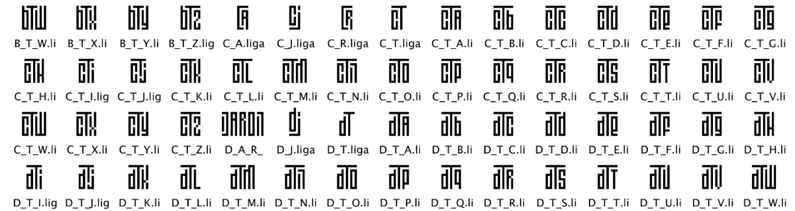
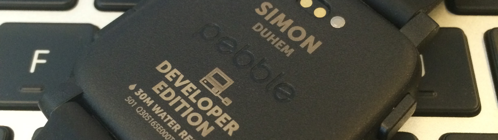
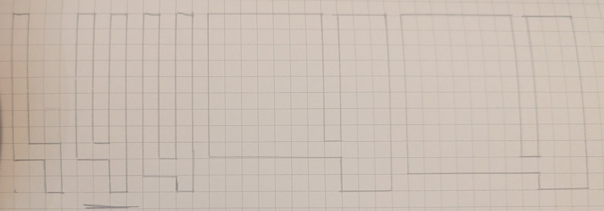
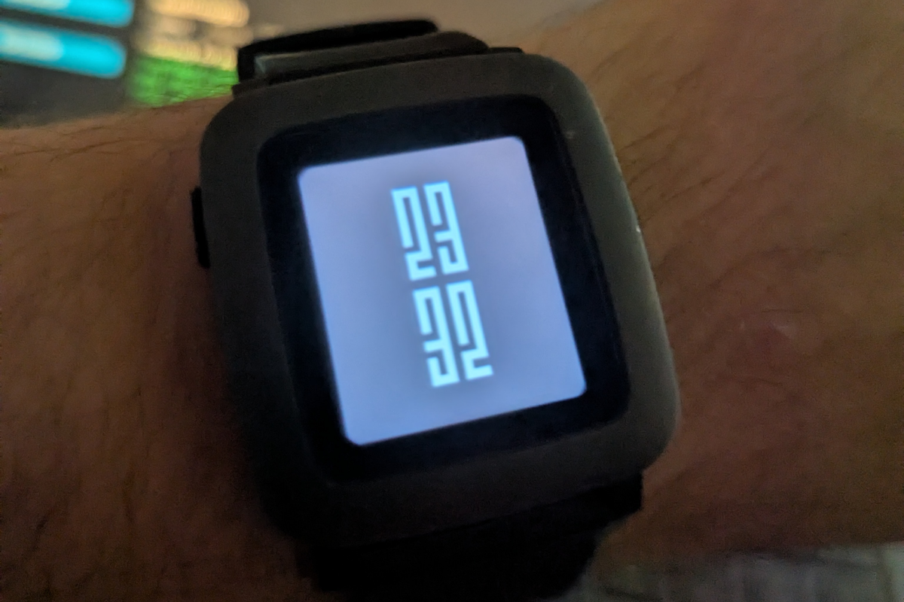
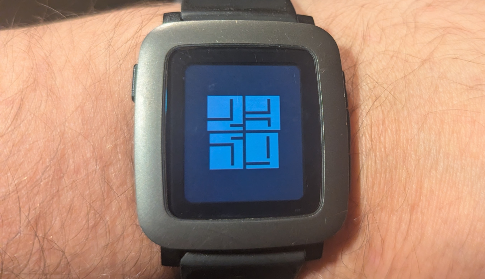
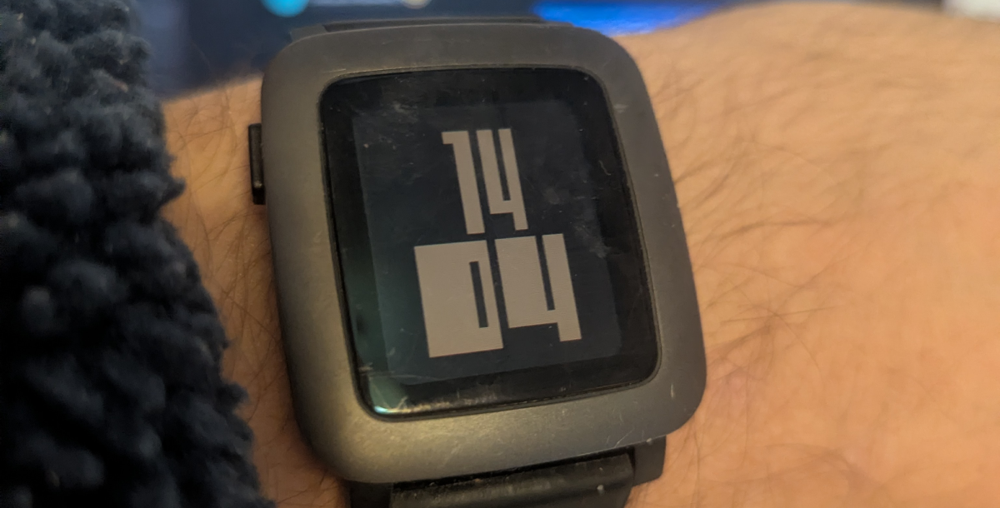
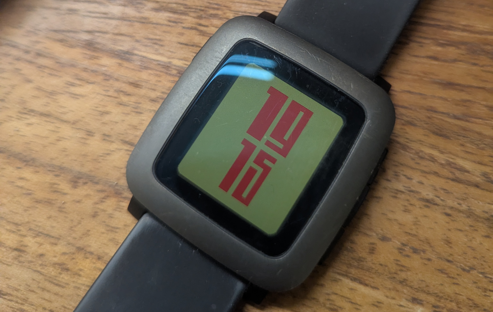

## Typographie

Je me suis toujours intéressé aux polices d'écriture.

Il y a quelques années, j'en ai même conçue une avec [Glyphs](https://glyphsapp.com/) : LSLT Regular.  
C'était avant tout un exercice : comprendre comment fonctionne une typographie, tester les ligatures (j'en avais créé beaucoup). Cette police ne m'a jamais vraiment servi, et elle avait d'ailleurs un petit problème de centrage... mais elle m'a énormément appris.

Depuis, les polices variables se sont démocratisées. Malheureusement, la version "mini" de Glyphs ne permet pas d'en créer, et 300€ pour un simple sujet de curiosité, c'était un peu trop.

À Paris Web, j'ai croisé [Damien Collot](https://www.linkedin.com/in/damien-collot-80177845/) de chez [Monotype](https://www.monotype.com).  
Au fil de la discussion, il m'a parlé de [Fontra](https://fontra.xyz/), une application open source permettant de créer des polices, y compris variables. À ce moment-là, je trouvais ça cool... sans avoir d'idée précise en tête.

## Pebble

J'ai eu une montre Pebble assez tôt. J'avais adoré le fait qu'elle soit ouverte aux développeurs. J'y avais développé quelques applications, sans jamais les publier.

Mon compte développeur étant actif, lors de [la seconde campagne Kickstarter](https://www.kickstarter.com/projects/getpebble/pebble-time-awesome-smartwatch-no-compromises), j'avais même reçu une Pebble Time Developer Edition, avec mon nom gravé dessus.

Mais Pebble n'a pas duré. La marque a été rachetée par Fitbit, elle-même rachetée par Google.  
Les serveurs ont fini par être éteints, et la montre a terminé... au fond d'un tiroir.

Il y a bien eu le projet Rebble pour maintenir l'écosystème en vie, et j'ai plusieurs fois hésité à m'y remettre, mais je trouvais ça un peu compliqué.

Puis, début d'année, [Google a décidé de rendre le code de Pebble open source](https://rebble.io/2025/01/27/the-future-of-rebble.html). Et Eric Migicovsky, le fondateur, [a annoncé le retour des montres](https://ericmigi.com/blog/why-were-bringing-pebble-back) avec de nouvelles Pebble 2, de nouveau disponibles.

Soudain, tout redevenait simple :
un SDK avec des infos claires pour l'installer, une application, un GitHub Codespace, une extension VS Code... Bref, tout ce qu'il fallait pour me donner envie de ressortir la montre du tiroir.

## L'idée de la watchface

La combinaison de ces deux événements m'a donné envie de faire une watchface pour ma Pebble Time fraîchement ressortie du tiroir.

Je n'avais pas encore d'idée très précise, mais
je voulais que les chiffres puissent évoluer visuellement, en passant d'une forme fine (3x11) en Regular à une forme carrée (11x11) en Extra Bold.

J'ai donc commencé par créer une nouvelle police, la LSLT Variable.
Comme elle était destinée à une montre, je me suis volontairement limité aux chiffres.

Fontra s'est révélé très agréable à utiliser, et j'ai rapidement obtenu exactement ce que j'avais en tête.

## Développement

Il fallait maintenant passer au développement de cette watchface, et ça a été un peu l'aventure.

Premier choix à faire : développer en C ou en JS.
Le choix était vite fait, mais j'ai rapidement eu une mauvaise surprise : il n'est pas possible d'utiliser une police externe dans les applications JS.

On se lance donc dans le développement d'une watchface en C, accompagné de mon agent Copilot 😅

J'arrive rapidement à avoir une watchface qui utilise ma police, mais elle reste en Regular. Je n'ai pas trouvé comment la faire varier. Déception.

Entre-temps, le concept de la watchface est trouvé : faire varier la police en fonction du temps.
Les minutes grossissent en fonction du nombre de secondes, et les heures en fonction des minutes. Il faut donc trouver un moyen de faire varier cette police.

En contournement, je me lance dans la génération de 60 déclinaisons de la police, pour changer celle utilisée en fonction du temps.
Ce n'est pas très propre, mais ça fonctionne.

Je me rends vite compte que les caractères ne sont pas affichés assez grand. La taille maximale semble limitée, et la watchface devient assez lourde, rien qu'à l'installation.
Ça ne va pas vraiment avec l'esprit Pebble.

C'est à ce moment-là que j'ai changé d'approche, les fichiers de Fontra sont assez proches de SVG : pour la version Regular et la Extra Bold, les formes sont les mêmes, seules leurs positions changent.
Pourquoi ne pas reproduire ce fonctionnement, en dessinant et en faisant varier la position des rectangles de chaque caractère en fonction du temps ?

Avec l'aide de Copilot, c'est ce que j'ai fait.
Ça ne s'est pas fait du premier coup, et j'ai quand même dû mettre le nez dans le code C pour bien calculer les positions et les espacements. Mais au final, j'ai obtenu la watchface que j'avais en tête.

## Résultat

Je suis plutôt content du résultat, et même du concept.

Je l'ai publiée sur le store de Rebble. Elle est disponible pour toutes les montres Pebble, anciennes comme nouvelles, rondes comme carrées : [LSLT | Watchface](https://apps.rebble.io/fr_FR/application/69372f6797c9a200096af59e?section=watchfaces)

N'hésitez pas à l'installer et à me dire ce que vous en pensez.

Si vous avez des idées d'amélioration, n'hésitez pas à me le faire savoir.
