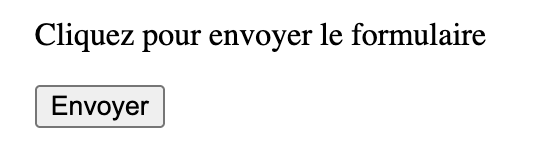
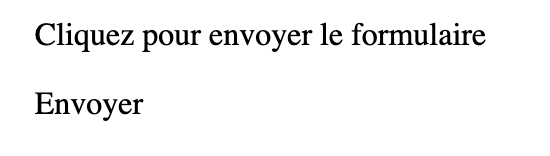

# Les Web Components et l’accessibilité

---

## Qui sommes-nous ?

- Simon Duhem, Architecte front-end [](https://www.linkedin.com/in/simonduhem/) [](https://github.com/smndhm)
- Nicolas Jouanno Daniel, Lead front-end [](https://www.linkedin.com/in/nicolasjouanno/) [](http://github.com/jn-prod)

### MGDIS [](https://www.mgdis.fr/)

- Core UI
  - Design System
    - mg-components [](https://github.com/MGDIS/core-ui/tree/master) [](https://mgdis.github.io/core-ui/)

---

## Qui êtes-vous ?

<!-- prettier-ignore -->
* Qui est développeur ?
* Qui fait déjà des Web Components ?
* Qui fait déjà de l'accessibilité ?

---

## Les Web Components

---

### Qu’est-ce qu’un composant ?

<!-- prettier-ignore -->
* Un composant est une brique d’interface autonome, regroupant structure, style et comportement.
* Il facilite la réutilisation et la maintenance du code.

---

### Qu’est-ce que les Web Components ?

---

#### Historique des Web Components

- 2011 : Proposés par Google.
- 2014 : Spécifications officielles publiées.
- 2016 : Adoption progressive dans les navigateurs modernes.
- Aujourd'hui : Standard mature, en évolution constante.

---

#### Les clés des Web Components

<!-- prettier-ignore -->
* Un standard web natif pour créer des composants personnalisés et encapsulés.  
* Indépendants des frameworks.
* Compatibles avec tous les navigateurs modernes.  
* Trois technologies clés : Custom Elements, **Shadow DOM** et HTML Templates.

---

##### Custom Elements

`<custom-element></custom-element>`

<!-- prettier-ignore -->
* Permettent de créer ses propres balises HTML avec un comportement spécifique.  
* Le nom doit contenir un tiret (`-`).  
* S’utilisent comme n’importe quel élément du DOM.  
* Doivent être enregistrés via `customElements.define()`.

---

##### Shadow DOM

```html
<custom-element>
  #shadow-root
  <p>Contenu encapsulé</p>
</custom-element>
```

<!-- prettier-ignore -->
* Permet d’encapsuler le style et le code d’un composant.  
* Crée une frontière entre le contenu interne et le reste du document.  
* Les styles définis à l’intérieur ne s’appliquent pas à l’extérieur, et ceux de l’extérieur n’affectent pas l’intérieur.  
* Deux modes :  
  - `open` : accessible via `.shadowRoot` en JavaScript.  
  - `closed` : inaccessible depuis l’extérieur.

---

##### Templates

```html
<template id="custom-element-template">
  <p>Hello Custom Element!</p>
</template>
```

<!-- prettier-ignore -->
* Contient du HTML.
* N'est pas affiché.
* On l’insère dans le Shadow DOM via JavaScript.

---

```html
<template id="custom-element-template">
  <p>Hello Custom Element!</p>
</template>

<script>
  class CustomElement extends HTMLElement {
    constructor() {
      super();
      const template = document.getElementById('custom-element-template');
      const content = template.content.cloneNode(true);

      const shadow = this.attachShadow({ mode: 'open' });
      shadow.appendChild(content);
    }
  }

  customElements.define('custom-element', CustomElement);
</script>

<custom-element></custom-element>
```

---

##### Rendu


```html
<custom-element>
  #shadow-root (open)
  <p>Hello Custom Element!</p>
</custom-element>
```

---

#### Librairies

- [Lit](https://lit.dev/)
- [Stencil](https://stenciljs.com/)

---

##### Le même composant avec Stencil

```TSX
import { Component, h } from '@stencil/core';

@Component({
  tag: 'custom-element',
  shadow: true,
})
export class CustomElement {
  render(): HTMLElement {
    return <p>Hello Custom Element!</p>;
  }
}
```

---

### Pourquoi les Web Components ?

<!-- prettier-ignore -->
* Un standard du W3C qui reste stable dans le temps.
* Des composants réutilisables partout, peut importe le framework.

---

## Conséquences sur l’accessibilité

---

### Exemple HTML

```html
<label for="input">Label</label>
<input type="text" id="input" aria-labelledby="tooltip aide erreur" />
<span id="tooltip">Tooltip</span>
<span id="aide">Aide à la saisie</span>
<span id="erreur">Message d'erreur</span>
```

---

### Atomic design + Shadow DOM

```html
<mg-form>
  <p id="info">Remplissez le formulaire et cliquez sur le bouton pour envoyer le formulaire</p>

  <mg-label for="input"></mg-label>
  <mg-tooltip id="tooltip"></mg-tooltip>
  <mg-help-text id="aide"></mg-help-text>
  <mg-message id="erreur"></mg-message>

  <mg-input id="input" aria-labelledby="tooltip aide erreur"></mg-input>
  <mg-button aria-labelledby="info">Envoyer</button>
</mg-form>
```

---

### Limite: Shadow DOM, Attributs ARIA et les lecteurs d’écran

```html
<p id="info">Remplissez le formulaire et cliquez sur le bouton pour envoyer le formulaire</p>
<my-button aria-describedby="info">Envoyer</my-button>

<template id="mg-button-template">
  <button>
    <slot></slot>
  </button>
</template>
<script>
  class MyButton extends HTMLElement {
    constructor() {
      super();
      const template = document.getElementById('mg-button-template');
      const content = template.content.cloneNode(true);

      this.attachShadow({ mode: 'open' });
      shadow.appendChild(content);
    }
  }

  customElements.define('my-button', MyButton);
</script>
```

---

#### ✅ DOM

Sémentiquement valide

```html
<p id="info">Remplissez le formulaire et cliquez sur le bouton pour envoyer le formulaire</p>
<my-button aria-describedby="info">
  #shadow-root (open)
  <button><slot></slot></button>
  "Envoyer"
</my-button>
```

---

#### ✅ VISUEL

Le contenu est bien rendu visuellement



---

#### 🚫 VoiceOver

La description n'est pas rendu au focus sur le bouton "Envoyer"

```txt
Envoyer, bouton
```

---

#### Version "amélioré"

```html
<p id="info">Remplissez le formulaire et cliquez sur le bouton pour envoyer le formulaire</p>
<my-button aria-describedby="info">Envoyer</my-button>

<template id="mg-button-template">
  <button>
    <slot></slot>
  </button>
</template>
<script>
  class MyButton extends HTMLElement {
    constructor() {
      super();
      const template = document.getElementById('mg-button-template');
      const content = template.content.cloneNode(true);

      this.attachShadow({ mode: 'open' });
      shadow.appendChild(content);
    }

    // AMELIORATION ?
    connectedCallback() {
      const btn = this.shadowRoot.querySelector('button');
      const attr = 'aria-labelledby';
      if (this.hasAttribute(attr)) {
        btn.setAttribute(attr, this.getAttribute(attr));
      }
    }
  }

  customElements.define('my-button', MyButton);
</script>
```

---

#### 🚫 DOM

Sémentiquement invalide

```html
<p id="info">Remplissez le formulaire et cliquez sur le bouton pour envoyer le formulaire</p>
<my-button aria-describedby="info">
  #shadow-root (open)
  <button aria-describedby="info"><slot></slot></button>
  "Envoyer"
</my-button>
```

---

#### ✅ VISUEL

Le contenu est bien rendu visuellement


---

#### 🚫 VoiceOver

La description n'est pas rendu au focus sur le bouton "Envoyer"

```txt
Envoyer, bouton
```

---

#### Problème: le Shadow DOM isole la structure du composant de son context.

<!-- prettier-ignore -->
* Les lecteurs d’écran ne font pas le lien avec les éléments encapsulés.
* Les `<slot />` et `aria-**` du context du composant ne sont pas associatiés avec le contenu du shadowDOM.
* Il faut propager correctement les rôles/labels depuis le host vers le shadow root.

---

##### Solution 1: Tout encapsuler dans le shadowDOM

```html
<my-button description="Remplissez le formulaire et cliquez sur le bouton pour envoyer le formulaire">Envoyer</my-button>

<template id="mg-button-template">
  <button>
    <slot></slot>
    <!-- Description interne, cachée visuellement mais lisible par screen readers -->
  </button>
  <p id="info"></p>
</template>
<script>
  class MyButton extends HTMLElement {
    constructor() {
      super();
      const template = document.getElementById('mg-button-template');
      const content = template.content.cloneNode(true);

      this.attachShadow({ mode: 'open' });
      shadow.appendChild(content);
    }

    connectedCallback() {
      const btn = this.shadowRoot.querySelector('button');
      const desc = this.shadowRoot.querySelector('#info');

      // Remplit la description avec la prop/attribut "description"
      if (this.hasAttribute('description')) {
        desc.textContent = this.getAttribute('description');
        btn.setAttribute('aria-describedby', 'info');
      }
    }
  }

  customElements.define('my-button', MyButton);
</script>
```

---

###### ✅ VISUEL


---

###### ✅ DOM

```html
<my-button description="Remplissez le formulaire et cliquez sur le bouton pour envoyer le formulaire">
  #shadow-root (open)
  <p id="info">Remplissez le formulaire et cliquez sur le bouton pour envoyer le formulaire</p>
  <button aria-describedby="info"><slot></slot></button>
  "Envoyer"
</my-button>
```

---

###### ✅ VoiceOver

```txt
Envoyer, Remplissez le formulaire et cliquez sur le bouton pour envoyer le formulaire, bouton
```

---

#### Solution 2: Intégrer le pattern ARIA sur l'host

```html
<p id="info">Remplissez le formulaire et cliquez sur le bouton pour envoyer le formulaire</p>
<my-button aria-describedby="info">Envoyer</my-button>

<template id="mg-button-template">
  <slot></slot>
</template>
<script>
  class MyButton extends HTMLElement {
    constructor() {
      super();
      const template = document.getElementById('mg-button-template');
      const content = template.content.cloneNode(true);

      this.attachShadow({ mode: 'open' });
      shadow.appendChild(content);
    }

    connectedCallback() {
      // Rendre le host focusable + bouton
      this.setAttribute('role', 'button');
      if (!this.hasAttribute('tabindex')) {
        this.setAttribute('tabindex', '0');
      } else if (this.hasAttribute('disabled')) {
        this.setAttribute('tabindex', '-1');
      }

      // Renseigner la description
      const desc = this.shadowRoot.querySelector('#info');
      if (this.hasAttribute('description')) {
        desc.textContent = this.getAttribute('description');
        this.setAttribute('aria-describedby', 'info');
      }

      // Gestion clavier (Entrée + Espace déclenchent "click")
      this.addEventListener('keydown', e => {
        if (e.key === 'Enter' || e.key === ' ') {
          e.preventDefault();
          this.click();
        }
      });
    }
  }

  customElements.define('my-button', MyButton);
</script>
```

---

##### 😬 VISUEL



---

##### ✅ DOM

```html
<p id="info">Remplissez le formulaire et cliquez sur le bouton pour envoyer le formulaire</p>
<my-button role="button" aria-describedby="info"> #shadow-root (open) "Envoyer" </my-button>
```

---

##### ✅ VoiceOver

```txt
Envoyer, Remplissez le formulaire et cliquez sur le bouton pour envoyer le formulaire, bouton
```

---

### Limite: Gestion des évènements

<!-- prettier-ignore -->
* Les évènements ne traversent pas automatiquement le Shadow DOM.

---

Dans un composant `<mg-input>`, avec plusieurs elements intératifs l'évènement de focus sera celui du host et non de l'input ou du tooltip qu'il contient.

Il y a un risque de confusion, il faut émettre un `new CustomEvent('input-focus', {})` depuis le host.

---

### A retenir

<!-- prettier-ignore -->
*	Là où c’est possible: réutiliser les éléments HTML natifs.
*	Si on doit créer un composant totalement custom, reconstruire le pattern ARIA sur le host ou dans le Shadow DOM.
* Tester systématiquement avec les lecteurs d’écran.
*	Le Shadow DOM n’est pas "mauvais" pour l’accessibilité, mais il demande une discipline stricte côté dev.

---

## Les audits

---

### Le désaccord

> [7.5](https://accessibilite.numerique.gouv.fr/methode/criteres-et-tests/#7.5) Dans chaque page web, les messages de statut sont-ils correctement restitués par les technologies d’assistance ?

<!-- prettier-ignore -->
* Pour l'auditeur, le rôle devait être sur le `<mg-message>` et nous pas dans dans le Shadow Dom.
* Le cas de test du critère :
  * Retrouver dans le document les messages qui valent pour message de statut.
  * Pour chacun de ces messages, déterminer la nature de l’information dont est porteur le message :
  * Si le message ...

---

### Les outils d’audit

---

### Ne prennent pas en compte le Shadow DOM

- [Nu Html Checker](https://validator.w3.org/nu/)
- [Assistant RGAA](https://addons.mozilla.org/fr/firefox/addon/assistant-rgaa/) - [GitHub](https://github.com/search?q=repo%3Aboscop-fr%2Fassistant-rgaa+shadowRoot&type=code)
- [Web Developer](https://addons.mozilla.org/fr/firefox/addon/web-developer/) - [GitHub](https://github.com/search?q=repo%3Achrispederick%2Fweb-developer+shadowRoot&type=code)
- [Stylus](https://addons.mozilla.org/fr/firefox/addon/styl-us/) - [GitHub](https://github.com/search?q=repo%3Aopenstyles%2Fstylus%20shadowRoot&type=code) - Issues pour prise en compte 👍

<!-- prettier-ignore -->
* [detectAutocomplete](https://github.com/search?q=repo%3AMewenLeHo%2FdetectAutocomplete%20shadowRoot&type=code) - [LinkedIn](https://www.linkedin.com/posts/mewenleho_github-mewenlehodetectautocomplete-bookmarklet-activity-7313195631567622144-kBXw)

---

### Prennent en compte le Shadow Dom :

- [HeadingsMap](https://addons.mozilla.org/fr/firefox/addon/headingsmap/)
- [WCAG Contrast checker](https://addons.mozilla.org/fr/firefox/addon/wcag-contrast-checker/)

---

- Utiles et précieux pour nos audits

<!-- prettier-ignore -->
* Indispensables pour gagner du temps et vérifier rapidement
* Mais pas toujours adaptés à certains projets
* Ils doivent évoluer pour mieux prendre en compte les Web components

---

## Les composants améliorent l’accessibilité

<!-- prettier-ignore -->
* Toute la logique est centralisée
* Une correction ou amélioration = partout corrigée
* Les champs se comportent tous de la même manière

---

## Conclusion

<!-- prettier-ignore -->
* Les Web Components sont un standard récent, qui doit coexister avec des spécifications historiques du RGAA.
* Nous avons déposé un dossier pour participer aux prochaines versions du RGAA, afin d’apporter notre expertise sur les Web Components.

---

## Questions ?

---

Merci
